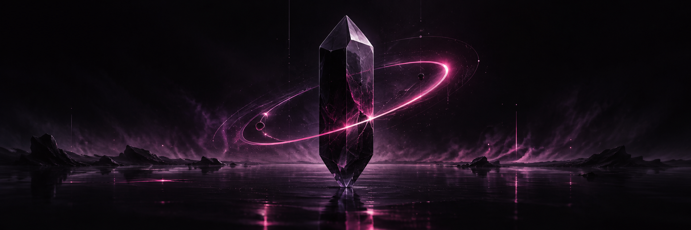

<div align="center">
  

  <br />

  <h1>LENA</h1>

  <p><strong>building software after dark.</strong></p>

  <p><code>Russia · UTC+3</code> &nbsp;·&nbsp; product-minded developer &nbsp;·&nbsp; quietly shipping</p>
</div>

---

### SIGNAL

I turn early ideas into focused digital products—clean interfaces on the surface,
careful systems underneath.

```text
01  mobile experiences
02  web products
03  AI-powered workflows
04  automation that removes the boring parts
```

### FREQUENCIES

<p>
  
  
  
  
  
  
</p>

### NOW

Designing thoughtful apps, exploring intelligent systems, and turning ambitious
concepts into things people can actually use.

> deliberate interfaces. reliable systems. a little mystery.

<div align="center">
  <sub>some projects are public. the interesting ones are still becoming.</sub>
</div>
