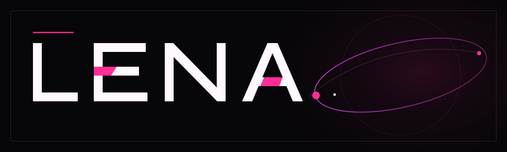

<div align="center">
  

  <br />

  <strong>I turn stubborn problems into clear products, expressive interfaces, and dependable tools.</strong>

  <br />
  <br />

  <code>Russia · UTC+3</code>
</div>

<br />

### What I build

I work across the full product surface: shaping the idea, designing the interaction, engineering the system, and testing the parts that usually get waved away at the end.

The medium changes. The standard does not. A useful result should feel obvious to the person using it and hold up when somebody looks beneath the surface.

<br />


<br />

### Released

#### [RunReceipt](https://github.com/hehehe224/runreceipt)

Cryptographic receipts that prove tests and builds really ran against a specific Git state. It is local, cross-platform, agent-agnostic, and stores output hashes instead of sensitive logs.

```bash
npx --yes github:hehehe224/runreceipt run -- npm test
```

Built for humans reviewing AI-assisted code, CI systems that need durable evidence, and coding agents that should prove their work instead of narrating it.

<br />


### Working range

- **Product:** direction, interaction design, clear UX writing
- **Interfaces:** responsive web, native mobile, design systems
- **Engineering:** TypeScript, Node.js, Python, Swift, React, APIs, PostgreSQL
- **Delivery:** testing, automation, release workflows, developer tooling

I choose the stack around the problem. Web, mobile, backend, automation, and developer infrastructure are all fair game.

### Rules of play

1. **Find the real problem.** A polished answer to the wrong question is still wrong.
2. **Make the path legible.** Good interfaces reduce uncertainty without flattening personality.
3. **Build the mechanism.** The invisible system deserves the same care as the visible screen.
4. **Ship the proof.** Tests, edge cases, and real evidence belong in the work, not in a promise after it.

<details>
  <summary><strong>Open the tool case</strong></summary>
  <br />
  <p><strong>Languages:</strong> Swift, TypeScript, JavaScript, Python, SQL</p>
  <p><strong>Surfaces:</strong> native mobile, responsive web, APIs, command-line tools, automation</p>
  <p><strong>Focus:</strong> product design, interaction quality, developer experience, testing, useful AI</p>
</details>

<br />

### Follow the work

The public repositories are the living portfolio. Each serious release gets working code, honest constraints, tests, and documentation that respects the reader's time.

If an idea is interesting, open an issue or start a discussion in the relevant repository.

<br />


<p align="center"><strong>Make it clear. Make it real. Leave proof.</strong></p>
