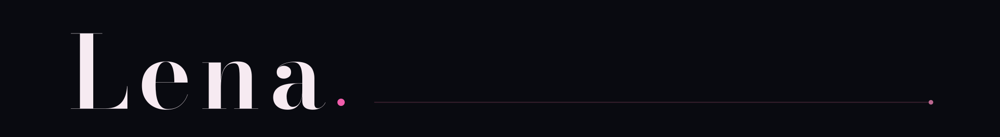

<div align="center">
  
  

  <br />

  <strong>Independent builder of software, interfaces, and useful tools.</strong>
</div>

<br />

### Selected work

#### [RunReceipt](https://github.com/hehehe224/runreceipt)

Verifiable, signed receipts tying test and build results to a specific Git state. RunReceipt is local, cross-platform, agent-agnostic, and stores output hashes instead of sensitive logs.

```bash
npx --yes github:hehehe224/runreceipt#v0.1.0 run -- npm test
```

Built for code review, CI workflows, and coding agents that should leave durable evidence behind.

<br />


### Across the stack

I take products from the first interaction decision through the system beneath it and the release path around it.

- **Native:** Swift, iOS product flows, mobile interaction design
- **Web:** TypeScript, JavaScript, React, responsive interfaces
- **Systems:** Node.js, Python, APIs, PostgreSQL, automation
- **Delivery:** testing, failure cases, CI, release tooling, documentation

The stack follows the problem. The quality bar stays put.

### Working rules

1. **Document the constraint.** Decisions are easier to trust when the tradeoff is visible.
2. **Test the failure case.** The awkward path is part of the product.
3. **Make the first run easy.** Useful software should not need a guided tour to prove its value.

### Follow the work

Public repositories are where the ideas become inspectable: working code, honest constraints, tests, and documentation.

Found a rough edge? [Browse the repositories and open an issue](https://github.com/hehehe224?tab=repositories).

<br />

<p align="center"><strong>Make it clear. Make it real. Leave proof.</strong></p>
